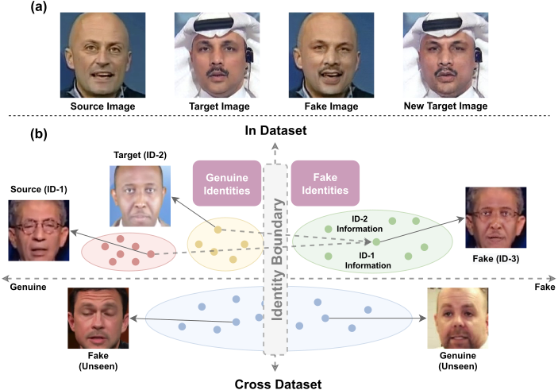

# Implicit Identity Leakage: The Stumbling Block to Improving Deepfake Detection Generalization

This repo includes the authors' [Pytorch](https://pytorch.org/) implementation of the paper:

#### [Implicit Identity Leakage: The Stumbling Block to Improving Deepfake Detection Generalization](https://arxiv.org/abs/2210.14457)

Computer Vision and Pattern Recognition (CVPR) 2023

[[arxiv](https://arxiv.org/abs/2210.14457)]

## Introduction

In this work, we take a deep look into the generalization ability of binary classifiers for the task of deepfake detection. Specifically, 

- We discover that deepfake detection models supervised only by binary labels are very sensitive to the identity information of the images, which is termed as the *Implicit Identity Leakage* in the paper. 

- Based on our analyses, we propose a simple yet effective method termed as the *ID-unaware Deepfake Detection Model* to reduce the influence of the ID representation, successfully outperforming other state-of-the-art methods.

  

## Updates

- [x] [03/2023] release the training and test code for our model 
- [x] [03/2023] release the pretrained weight 

## Dependencies

* Python 3 >= 3.6
* Pytorch >= 1.6.0
* OpenCV >= 4.4.0
* Scipy >= 1.4.1
* NumPy >= 1.19.5

## Data Preparation

##### Take FF++ as an example:

1. Download the dataset from [FF++](https://github.com/ondyari/FaceForensics) and put them under the *./data*.

```
.
└── data
    └── FaceForensics++
        ├── original_sequences
        │   └── youtube
        │       └── raw
        │           └── videos
        │               └── *.mp4
        ├── manipulated_sequences
        │   ├── Deepfakes
        │		├── raw
        │			└── videos
        │               └── *.mp4
        │   ├── Face2Face
        │		...
        │   ├── FaceSwap
        │		...
        │   ├── NeuralTextures
        │		...
        │   ├── FaceShifter
        │		...
```

2. Download the landmark detector from [here](https://github.com/codeniko/shape_predictor_81_face_landmarks) and put it in the folder *./lib*.

3. Run the code to extract frames from FF++ videos and save them under the *./train_images* or *./test_images* based on the division in the original dataset.

   ```
    python3 lib/extract_frames_ldm_ff++.py
   ```

## Pretrained weights

You can download pretrained weights [here](https://drive.google.com/file/d/1JNMI4RGssgCOl9t05jkUa6imnw5XR5id/view?usp=sharing). 

## Evaluations

To evaluate the model performance, please run: 

```
python3 test.py   --cfg ./configs/caddm_test.cfg
```

## Results

Our model achieved the following performance on:

| Training Data | Backbone        | FF++       | Celeb-DF   | DFDC       |
| ------------- | --------------- | ---------- | ---------- | ---------- |
| FF++          | ResNet-34       | 99.70%     | 91.15%     | 71.49%     |
| FF++          | EfficientNet-b3 | 99.78%     | 93.08%     | 73.34%     |
| FF++          | EfficientNet-b4 | **99.79%** | **93.88%** | **73.85%** |

Note: the metric is *video-level AUC*.

## Training

To train our model from scratch, please run :

```
python3  train.py --cfg ./configs/caddm_train.cfg
```

## Citation

Coming soon

## Acknowledgements

- [SSD](https://arxiv.org/abs/1512.02325)

## Contact

If you have any questions, please feel free to contact us via jirenhe@megvii.com.
